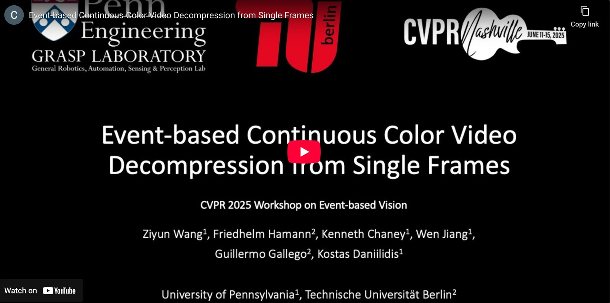
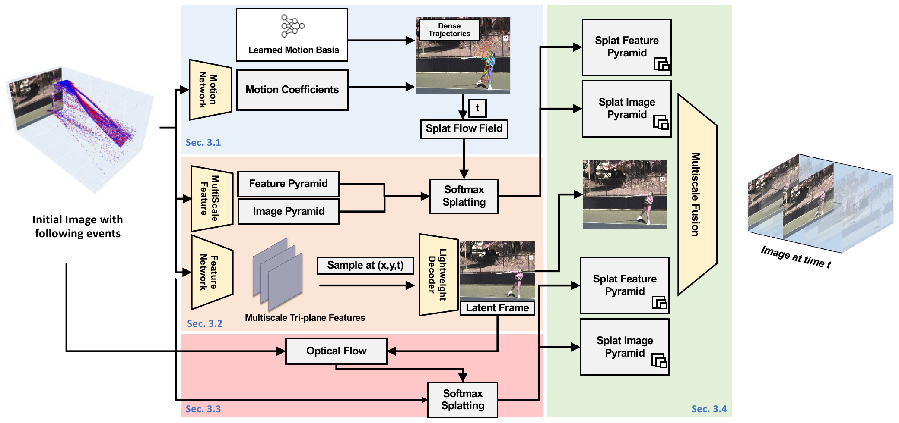
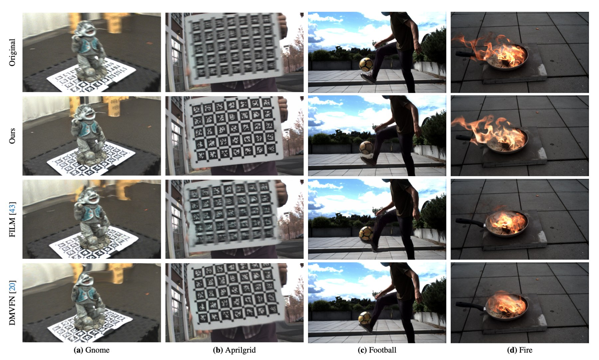
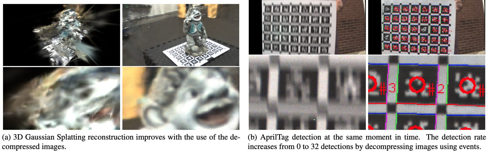

<div align="center">

# ContinuityCam: Event-based Continuous Color Video Decompression from Single Frames

[](https://www.python.org/downloads/)
[](https://pytorch.org/)
[](LICENSE)

[Ziyun Wang](https://ziyunclaudewang.github.io/)<sup>1</sup>, [Friedhelm Hamann](https://friedhelmhamann.github.io/)<sup>2</sup>,
Kenneth Chaney<sup>1</sup>, Wen Jiang<sup>1</sup>, [Guillermo Gallego](https://sites.google.com/view/guillermogallego)<sup>2</sup>,
[Kostas Daniilidis](https://www.cis.upenn.edu/~kostas/)<sup>1,3</sup>

<sup>1</sup>University of Pennsylvania, <sup>2</sup>TU Berlin, <sup>3</sup>Archimedes, Athena RC  
CVPR 2025 Workshops (Event-based Vision)

[Paper](https://openaccess.thecvf.com/content/CVPR2025W/EventVision/papers/Wang_Event-based_Continuous_Color_Video_Decompression_from_Single_Frames_CVPRW_2025_paper.pdf) ·
[Supplement](https://openaccess.thecvf.com/content/CVPR2025W/EventVision/supplemental/Wang_Event-based_Continuous_Color_CVPRW_2025_supplemental.pdf) ·
[arXiv](https://arxiv.org/abs/2312.00113) ·
[Project page](https://ziyunclaudewang.github.io/continuitycam/) ·
[Video](https://www.youtube.com/watch?v=whmCB-07Y1k)

**TL;DR:** one static color frame plus events becomes a temporally continuous video, queryable at any time between
the events.

</div>

<p align="center">
  <a href="https://www.youtube.com/watch?v=whmCB-07Y1k"></a>
</p>

## How it works



A motion network turns the event volume into dense trajectories via a learned motion basis, which are sampled at a
query time t to give a splat flow field. Softmax splatting warps the feature and image pyramids of the initial frame
along that field, while a feature network builds multiscale tri-plane features that a lightweight decoder samples at
(x, y, t). Optical flow between the initial frame and that synthesized latent frame splats the pyramids a second
time, and multiscale fusion combines everything into the image at time t.

Reconstructions on the E2D2 dataset across a range of lighting and motion profiles, compared against event- and
image-based baselines (from the paper):



Decompressed frames also help downstream perception: 3D Gaussian Splatting reconstructions improve when built from
them, and AprilTag detection at the same instant goes from 0 to 32 detections:



## Results

BS-ERGB test set (`1_TEST`), TimeLens protocol (key frames `skip+1` frames apart, the frames in between predicted
from the previous key frame and the events), at the sensor resolution (970x625). PSNR and LPIPS (AlexNet) are
averaged per sequence and then over sequences. Baselines are from Table 2 of the paper.

| Method | Events | skip 1 PSNR ↑ | skip 1 LPIPS ↓ | skip 3 PSNR ↑ | skip 3 LPIPS ↓ |
|---|:---:|:---:|:---:|:---:|:---:|
| [DMVFN](https://github.com/megvii-research/CVPR2023-DMVFN) | ✗ | 22.63 | 0.218 | 21.11 | 0.250 |
| [E-RAFT](https://github.com/uzh-rpg/E-RAFT) unrolling | ✓ | 19.28 | 0.171 | 17.49 | 0.257 |
| [E-RAFT](https://github.com/uzh-rpg/E-RAFT) (inpainted) | ✓ | 20.40 | 0.160 | 18.79 | 0.222 |
| [RAFT](https://github.com/princeton-vl/RAFT) unrolling | ✗ | 22.85 | 0.120 | 20.88 | 0.197 |
| [RAFT](https://github.com/princeton-vl/RAFT) (inpainted) | ✗ | 23.41 | 0.097 | 20.88 | 0.142 |
| | | | | | |
| Ours | ✓ | 26.30 | 0.083 | 25.48 | 0.095 |

The numbers differ slightly from the paper's: this release fixes a bug in the design of the U-Net so that it
projects features onto the tri-planes better, and trains with additional temporal augmentation (event windows of
varying length).

E2D2 test set (our beamsplitter dataset, 640x480): key frames every 0.25 s, all frames in between predicted. As in the
paper, the metrics are averaged over all test frames; baselines are from Table 1 of the paper. These numbers use the E2D2
model, `continuitycam_e2d2.ckpt`.

| Method | Events | PSNR ↑ | LPIPS ↓ | SSIM ↑ |
|---|:---:|:---:|:---:|:---:|
| [E-RAFT](https://github.com/uzh-rpg/E-RAFT) unrolling | ✓ | 17.19 | 0.257 | 0.583 |
| [E-RAFT](https://github.com/uzh-rpg/E-RAFT) (inpainted) | ✓ | 19.58 | 0.260 | 0.623 |
| [RAFT](https://github.com/princeton-vl/RAFT) unrolling | ✗ | 19.35 | 0.197 | 0.629 |
| [RAFT](https://github.com/princeton-vl/RAFT) (inpainted) | ✗ | 20.88 | 0.222 | 0.659 |
| [DMVFN](https://github.com/megvii-research/CVPR2023-DMVFN) | ✗ | 25.93 | 0.111 | 0.767 |
| | | | | |
| Ours | ✓ | 29.26 | 0.066 | 0.811 |

**Continuity.** The model can be queried at any time t. The paper's protocol only uses t = k/6; on BS-ERGB test windows
squeezed to r frame intervals (see [below](#pretrained-model-and-evaluation)), the frames in between sit at t = k/r
(skip 3):

| window r | 4 | 5 | 7 | 8 |
|---|---|---|---|---|
| PSNR / LPIPS | 24.69 / 0.105 | 24.07 / 0.110 | 24.32 / 0.106 | 23.84 / 0.110 |

Frames very close to the key frame (t < 1/8) are somewhat less accurate than the rest.

## Setup

Requirements: Python 3.8.5, PyTorch 1.12.1, CUDA 11.3 (see `env/environment.yml`).

```bash
git clone https://github.com/ZiyunClaudeWang/event-continuitycam.git && cd event-continuitycam
conda env create -f env/environment.yml && conda activate continuitycam
mkdir -p $CONDA_PREFIX/etc/conda/activate.d && cp env/activate_cuda_path.sh $CONDA_PREFIX/etc/conda/activate.d/
conda activate continuitycam    # again, to pick up CUDA_PATH (used by the softmax-splatting kernels)
```

Download the pretrained models (BS-ERGB and E2D2) and FILM's feature extractor (`extract.pt`, used frozen; Apache 2.0) from the
[releases page](../../releases) into the repository root; RAFT-large (torchvision) and the LPIPS networks are
downloaded automatically:

```bash
wget https://github.com/ZiyunClaudeWang/event-continuitycam/releases/download/v1.0/{continuitycam_bsergb.ckpt,continuitycam_e2d2.ckpt,extract.pt,SHA256SUMS.txt}
sha256sum -c SHA256SUMS.txt
```

Inference at the full resolution (970x625) needs about 10 GB of GPU memory.

## Data

Download [BS-ERGB](https://github.com/uzh-rpg/timelens-pp) and use it as released
(`<root>/{1_TEST,2_VALIDATION,3_TRAINING}/<seq>/{images,events}` and the `meta_timelens_*.txt` files); events are
read directly and voxelized on the GPU. Link it as `datasets/bs_ergb` (or pass `--root` to the scripts):

```bash
mkdir -p datasets && ln -s /path/to/bs_ergb datasets/bs_ergb
```

E2D2 (our beamsplitter dataset; only needed for the E2D2 evaluation): download it from
[OneDrive](https://livejohnshopkins-my.sharepoint.com/:f:/g/personal/zwang570_jh_edu/IgBjA_dADy6sQL0kGSqq6lQDAVsxbConVF1XcH-IJecmpkA)
(41 GB: `3_TRAINING`, `2_VALIDATION`, `1_TEST`, each sequence a `seq.h5` with frames, events and their timestamps, plus
the `meta_penn_*.txt` split files; the evaluation needs only `1_TEST` and `meta_penn_1_TEST.txt`) and link it as
`datasets/e2d2`:

```bash
ln -s /path/to/e2d2 datasets/e2d2
```

## Pretrained model and evaluation

With the checkpoints downloaded (see [Setup](#setup)), render a continuous video from one key frame and the events of
the next 6 frame intervals:

```bash
python scripts/demo.py --ckpt continuitycam_bsergb.ckpt --seq 1_TEST/acquarium_08 --start 20 --frames 61 --out demo
```

This writes 61 frames at t = 0, 1/60, ..., 1 (`demo/NNNN.png`) and `demo/demo.mp4` (prediction next to the ground
truth at the last frame time). To evaluate on the BS-ERGB test set:

```bash
python scripts/evaluate.py --ckpt continuitycam_bsergb.ckpt --skip 1 --out skip1.json
python scripts/evaluate.py --ckpt continuitycam_bsergb.ckpt --skip 3 --out skip3.json
```

Key frames are `skip+1` frames apart; each frame in between is predicted from the previous key frame and the
events. Predictions are written as 8-bit images and compared with the original PNGs, as in the paper's evaluation.

**Continuity.** The model takes the events of a window cut into 6 slices and a target time t in [0, 1]. The paper's
protocol only asks for frames at t = k/6 (window = 6 frame intervals). `--window r` squeezes the events of r frame
intervals into the same 6 slices, so the frames in between are queried at t = k/r, times the protocol never uses:

```bash
for r in 4 5 7 8; do
  python scripts/evaluate.py --ckpt continuitycam_bsergb.ckpt --skip 3 --window $r --out skip3_r$r.json
done
```

**E2D2.** The same with the E2D2 model (windows of 0.25 s; the last line of the output is the mean over all frames, as
in the paper):

```bash
python scripts/evaluate.py --dataset e2d2 --ckpt continuitycam_e2d2.ckpt --out e2d2.json
python scripts/demo.py --dataset e2d2 --ckpt continuitycam_e2d2.ckpt --seq 1_TEST/231030_160305_crossroad --start 0 --out demo_e2d2
```

## Code layout

```
continuitycam/
  models/continuitycam.py  full network and load_model(): latent-frame RAFT flow + multi-scale fusion (Sec. 3.3-3.4)
  models/motion.py         trajectory field: event U-Net + learned time basis (Sec. 3.1)
  models/synthesis.py      tri-plane neural synthesis (Sec. 3.2)
  models/unet.py, film.py, softsplat.py   building blocks (U-Net, FILM features/fusion, softmax splatting)
  data/                    BS-ERGB and E2D2 readers, GPU event voxelization
scripts/                   evaluate.py (metrics), demo.py (continuous video)
env/                       pinned conda environment
assets/                    figures for this README
```

## Citation

```bibtex
@inproceedings{wang2025continuitycam,
  title={{Event-based Continuous Color Video Decompression from Single Frames}},
  author={Wang, Ziyun and Hamann, Friedhelm and Chaney, Kenneth and Jiang, Wen
          and Gallego, Guillermo and Daniilidis, Kostas},
  booktitle={IEEE/CVF Conference on Computer Vision and Pattern Recognition (CVPR) Workshops},
  year={2025}
}
```

## Acknowledgements

We gratefully acknowledge the support of the GRASP Laboratory at the University of Pennsylvania and the Robotic
Interactive Perception group at TU Berlin. This code builds on [FILM](https://github.com/google-research/frame-interpolation)
(feature extractor and fusion decoder), [softmax splatting](https://github.com/sniklaus/softmax-splatting),
[RAFT](https://github.com/princeton-vl/RAFT) (torchvision), [K-Planes](https://sarafridov.github.io/K-Planes/) and
[LPIPS](https://github.com/richzhang/PerceptualSimilarity).

## License

MIT (see [LICENSE](LICENSE)), except for third-party code and weights: `continuitycam/models/softsplat.py` is from
[softmax splatting](https://github.com/sniklaus/softmax-splatting), whose authors provide it strictly for academic
purposes; FILM's code and the `extract.pt` weights are under the Apache License 2.0.
